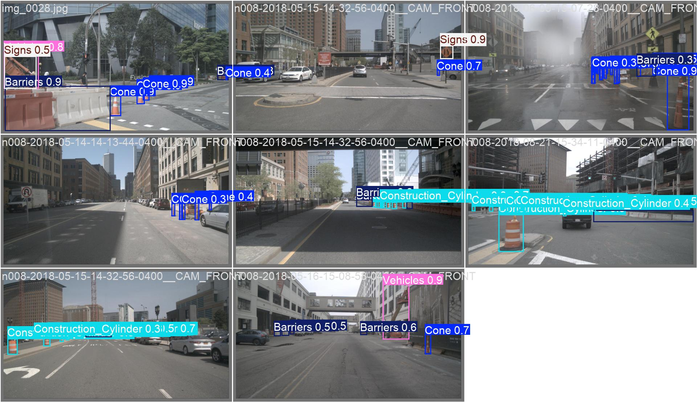
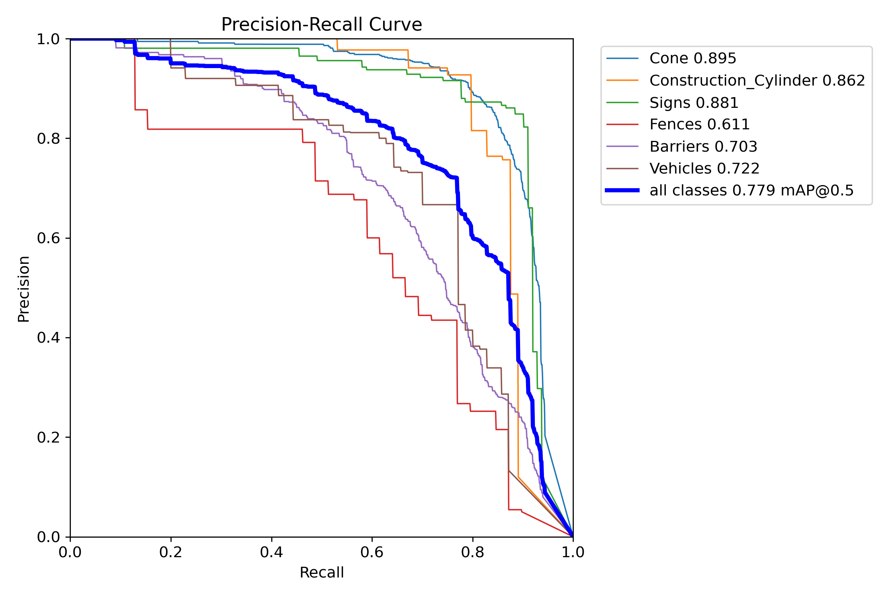
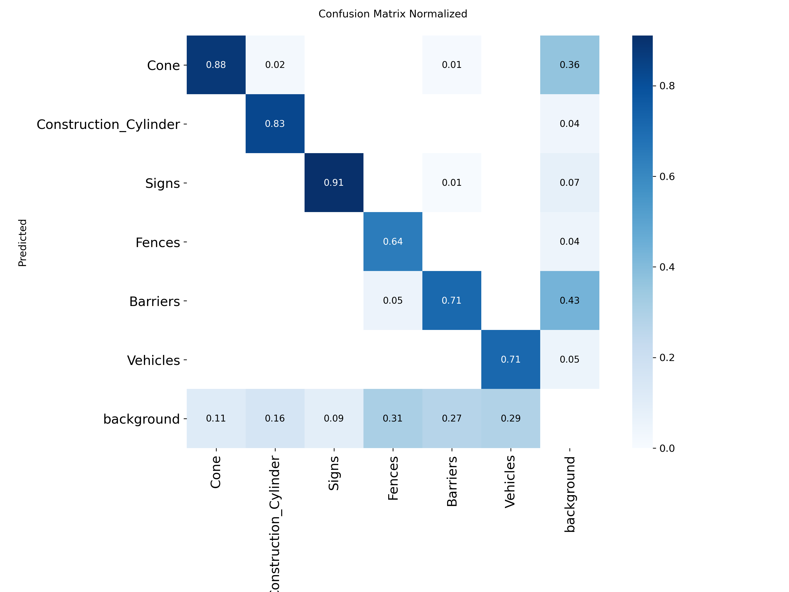

# Real-Time Construction Site Object Detection for Autonomous Vehicles

A camera-only YOLOv11s detector that identifies construction-zone objects in dashcam imagery at over 140 FPS, trained on a hand-annotated dataset of 6,433 object instances.

Third place, Engineering category, Regeneron Westchester Science & Engineering Fair (WESEF) 2025.



**[Read the paper](construction-zone-detection-paper.pdf)**

## Problem

Construction zones are hard for autonomous vehicles. Object layouts, colors, occlusions, and scales vary heavily between scenes, and temporary infrastructure doesn't appear in HD maps. This project tests whether a single real-time camera-only detector can recognize construction-zone elements without LiDAR, radar, or sensor fusion.

The model detects six classes: cones, construction cylinders, signs, fences, barriers, and vehicles.

## Dataset

1,000 forward-facing dashcam images were manually selected from [nuScenes](https://www.nuscenes.org/), annotated in CVAT, and exported in YOLO format with an 80/20 train/validation split.

| Class | Instances |
| --- | ---: |
| Cone | 3,519 |
| Barriers | 1,629 |
| Signs | 593 |
| Vehicles | 289 |
| Construction Cylinder | 268 |
| Fences | 135 |
| **Total** | **6,433** |

The class distribution is heavily imbalanced, which shows up directly in the results below. An early version of the annotation schema included a construction-worker class; it was dropped because it was too easily confused with general pedestrians.

**The image data is not redistributed here.** nuScenes is free for non-commercial use but restricts redistribution, so only the trained model's outputs and evaluation artifacts appear in this repository. The dataset can be obtained directly from nuScenes.

## Results

Validation performance, YOLOv11s:

| Class | Precision | Recall | F1 | mAP@0.5 | mAP@0.5:0.95 |
| --- | ---: | ---: | ---: | ---: | ---: |
| Cone | 0.862 | 0.839 | 0.850 | 0.895 | 0.505 |
| Construction Cylinder | 0.827 | 0.797 | 0.811 | 0.862 | 0.508 |
| Signs | 0.861 | 0.866 | 0.863 | 0.881 | 0.595 |
| Fences | 0.687 | 0.564 | 0.620 | 0.611 | 0.336 |
| Barriers | 0.664 | 0.651 | 0.657 | 0.703 | 0.440 |
| Vehicles | 0.723 | 0.673 | 0.697 | 0.722 | 0.383 |
| **Overall** | **0.771** | **0.731** | **0.751** | **0.779** | **0.461** |

Best overall F1 of 0.75 occurs at a confidence threshold of 0.343.

Inference runs in roughly 7 ms per frame end to end, including preprocessing, forward pass, and postprocessing — over 140 FPS on an RTX 2080 SUPER, comfortably inside real-time requirements for in-vehicle perception.





## What the errors show

Cones, construction cylinders, and signs perform best. They are visually distinctive, appear at consistent scales, and are well represented in the training data.

Fences and vehicles perform worst. Both have few training examples and high visual variance — fences in particular range from orange plastic mesh to chain-link to solid hoarding, with only 135 instances to learn from.

Barriers are the interesting failure. They are common in the data but score only 0.703 mAP@0.5, because barrier runs were sometimes annotated as several adjacent boxes rather than one. That inconsistency taught the model to over-segment, which shows up as reduced precision rather than reduced recall.

## Repository contents

```text
.
├── construction-zone-detection-paper.pdf   Full research paper
├── train.py                                YOLOv11s training script
├── data.yaml                               Dataset config
├── inference.py                            Batch image inference
└── runs/detect/train3/                     Training and validation artifacts
    ├── results.png, results.csv            Training curves and per-epoch metrics
    ├── BoxPR_curve.png, BoxF1_curve.png    Precision-recall and F1 curves
    ├── confusion_matrix_normalized.png     Per-class confusion
    ├── val_batch*_pred.jpg                 Model predictions on validation images
    └── args.yaml                           Full training configuration
```

Trained weights and the image dataset are not included — see the dataset note above.

## Reproducing

```bash
pip install ultralytics opencv-python
```

Obtain the nuScenes images, annotate or supply YOLO-format labels, then update the `train` and `val` paths in `data.yaml` to point at your local copy:

```bash
python train.py
```

`train.py` fine-tunes `yolo11s.pt` for 60 epochs with SGD, batch size 4, and mosaic, mixup, and copy-paste augmentation. Note that the results reported above were produced at `imgsz=1024`, matching `runs/detect/train3/args.yaml`; the current script sets `imgsz=1200`, which may improve small-object recall at higher memory cost.

To run inference, set `MODEL_PATH` in `inference.py` to your trained checkpoint and `IMAGE_DIR` to a folder of images.

## Future work

- Expand the dataset across more regions, weather, and lighting conditions
- Add fence and vehicle examples to address the class imbalance driving the worst results
- Replace split barrier bounding boxes with segmentation masks, and train a YOLO segmentation model for objects where boxes capture too much background
- Make model and dataset paths configurable via command-line arguments

## Acknowledgments

Imagery derived from the [nuScenes](https://www.nuscenes.org/) dataset, annotated using [CVAT](https://www.cvat.ai/). Detection built on the [Ultralytics](https://github.com/ultralytics/ultralytics) YOLO framework.
